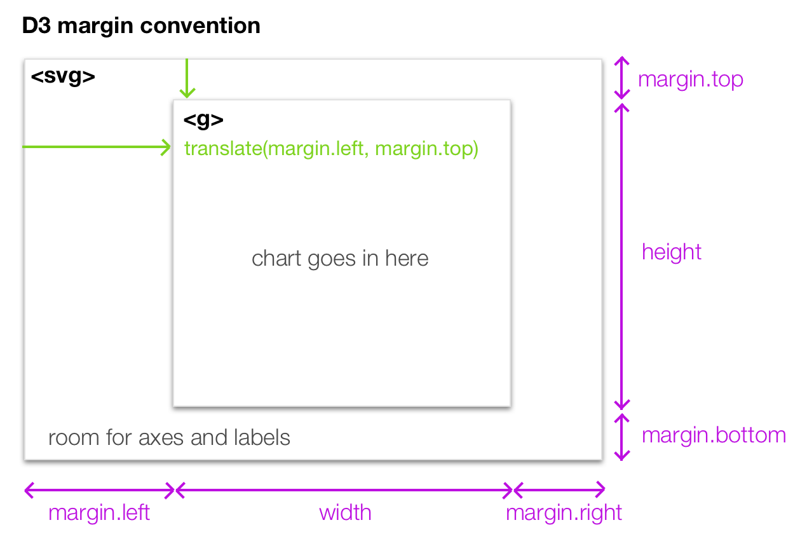

# Intermediate D3 workshop at NICAR 2018
We will build on D3.js basics by exploring more complex chart forms, covering functions for fetching and manipulating data, and introducing transitions and interaction. We will write working code together and break down how some of our favorite examples of D3 charts work.

This is designed to build on [the beginner workshop](https://github.com/darlacameron/beginning-d3-nicar-2018).

## Steps to get started
1. Download or `git clone` this repository.
2. In terminal, run the command `python -m SimpleHTTPServer 8000`
3. In a browser, open the url http://localhost:8000/
4. In a text editor (e.g. Sublime Text), open the repository folder.
5. Start with 1-dom-manipulation/index.html

## Follow along
[View the slides](https://docs.google.com/presentation/d/1DXY_PkQkBEmbOnIxSiOCfRUc-VDIJtcnInt7mubyP-w/edit?usp=sharing)

[Docs: everything D3 can do](https://github.com/d3/d3/blob/master/API.md)

We will make an animated chart together that shows the relationship between health spending and life expectancy using data from [the OECD](http://stats.oecd.org/#). This chart was inspired by Peter Aldhous ([you can view his implementation in R here](https://github.com/BuzzFeedNews/2017-05-us-health-care/)).

Each step builds upon the last one. We will discuss the new concepts introduced in the step, read some documentation and then write a few lines of code (look for commented `TODO`s). If you get stuck, you can always peek at the next step to see how I wrote the code.

## 1. Functional programming and data analysis

[starting point](/01-working-with-data)

First, lets load our data: [Docs: d3.csv](https://github.com/d3/d3-request/blob/master/README.md#csv).

    d3.csv(‘oecd.csv’, function(data) { // do things with the data });

Take a look at your data using `console.log(data)` or `console.table(data)`.

Now let’s play with the data, using built in Array functions:

- [docs: Array.filter](https://developer.mozilla.org/en-US/docs/Web/JavaScript/Reference/Global_Objects/Array/filter)
- [docs: Array.map](https://developer.mozilla.org/en-US/docs/Web/JavaScript/Reference/Global_Objects/Array/map)

TASK: filter out values where one or both are NA. Then create arrays of life expectancies and health expenditures using `.map()`.

Finally, lets play with some helpful [d3-array](https://github.com/d3/d3-array/) functions:

[d3.max](https://github.com/d3/d3-array/#max), [d3.min](https://github.com/d3/d3-array/#min), [d3.mean](https://github.com/d3/d3-array/#mean), [d3.median](https://github.com/d3/d3-array/#median), [d3.extent](https://github.com/d3/d3-array/#extent)

[what it should look like](/02-nesting-data)

## 2. Grouping data

[starting point](/02-nesting-data)

Our goal is to structure the data in the way we want our SVG to be structured.

`d3.nest()` is like `GROUP BY` in SQL

[Docs: d3.nest](https://github.com/d3/d3-collection#nests)

`.entries(data)` takes your data as an argument and returns an array

`.map()` returns an object which is useful for creating lookup tables. There's also `.object()` which you can use if you are sure your data doesn't collide with js reserved words. JS objects are not equivalent to hash tables like python `dict`s but can be used in much the same way.

Try it out with [Mr. Nester](/mister-nester/).

create an object called `dataByYear` and use it with your circle selection. Try different years

Now repeat the excercise using `.entries`. Note that the structure changes.

[what it should look like](/03-scatter)

## 3. Scatter plot
[starting point](/03-scatter)

### setting up the chart

First we need to set up our chart. We will use the Mike Bostock's D3 margin convention. This convention is not technically necessary to set up a chart, but it is widely used in the D3 community.

The convention makes use of two new concepts: `<g>` and `transform`. `<g>` is an SVG element that groups other SVG elements. `transform` is an SVG attribute that can `translate`, `rotate` and `scale` an element.

[Docs for `<g>`](https://developer.mozilla.org/en-US/docs/Web/SVG/Element/g)

[Docs for `transform`](https://developer.mozilla.org/en-US/docs/Web/SVG/Attribute/transform)

### defining scales

[Docs: d3-scale](https://github.com/d3/d3-scale)

Next, choose what variable goes on each axis. We will be using health expenditures on x and life expectancy on y.

Since the minimum value for health expenditures is relatively near zero on our scale, it is good practice to include zero in the domain.

    var xScale = d3.scaleLinear()
	    .range([0, width]);
        .domain([0, d3.max(healthExpenditures)])

Task: write the y scale, using the extent of the life expectancy for the domain. Note that zero in SVG is at the top, so you’ll want to flip your range.

### drawing circles

Task: use the [`.data().enter().append()` pattern](https://github.com/d3/d3-selection#selection_data) to draw circles based on our `oecd` data. When you get that working, try using just a single year from `dataByYear`.

[Docs: SVG circle](https://developer.mozilla.org/en-US/docs/Web/SVG/Element/circle)

Extra credit: see what happens if you change the domain of your y scale to include zero. When MUST a chart have a zero baseline? [(more on this topic)](https://www.washingtonpost.com/graphics/politics/2016-election/trump-charts/) Try plotting the year on the x-axis rather than health expenditures.

[what it should look like](/04-axes)

## 4. Axes
[starting point](/04-axes)

[Docs: D3 axis](https://github.com/d3/d3-axis)

Demo: create an x axis

Task: create a y axis

The backbone of the axis is a `<path>` while the ticks are `<line>`s so you can easily style them separately with CSS.

We can make a dashed line with `stroke-dasharray: TKpx TKpx;`.

Task: reduce the number of ticks and make the y axis ticks extend across the chart

Use a `transform` to move your axis around.

Play with the following:

`.tickSize` to specify length of ticks. Try making your axes as wide and tall as your chart.

`.ticks` to specify number of ticks

`.tickFormat` format the tick

[Docs: axis ticks](https://github.com/d3/d3-axis#axis_ticks)

[what it should look like](/05-annotations)

## 5. Annotations

[starting point](/05-annotations)

Our chart is meaningless without labels. Let's label the axes and (some of) the points using SVG `<text>` elements.

[Docs: `<text>`](https://developer.mozilla.org/en-US/docs/Web/SVG/Element/text)

[Docs: text-anchor](https://developer.mozilla.org/en-US/docs/Web/SVG/Attribute/text-anchor)

[what it should look like](/06-connected-scatter)

## 6. Connected scatterplot

[starting point](/06-connected-scatter)

Lets make a connected scatterplot by drawing a path for each country. Connected scatterplots are cool because they give us an alternate way to present comparative time series data. The effectiveness of this chart type is highly dependent on trends in your data. If your dataset has heavily cyclical trends, for instance, a connected scatterplot may end up looking like an incomprehensible scribble. But with the right data they can really shine. [Learn more.](https://eagereyes.org/papers/the-connected-scatterplot-for-presenting-paired-time-series)

We can use the data we grouped by country in step 2 and the scales we already set up in step 3.

[Docs: d3.line](https://github.com/d3/d3-shape#lines)

[what it should look like](/07-advanced-enter-exit-pattern)

## 7. Advanced update pattern

[starting point](/07-advanced-enter-exit-pattern)

In order to support animation and interaction, we need to be able to dynamically update the data in our selections. In this step we will write a function that we can call to update our data.

We are familiar with `.enter()` which gets called for new data points. But now we need to define what happens when data points update (`.merge()`) or are removed (`.exit()`).

We also need to tell `.data()` how to index our dataset (linking data points between updates) by writing a key function.

docs: [.data() key function](https://github.com/d3/d3-selection#selection_data), [Bostock's explanation](https://bost.ocks.org/mike/constancy/)

[what it should look like](/08-transitions)

## 8. Transitions

[starting point](/08-transitions)

[Docs: d3 transition](https://github.com/d3/d3-transition)

Demo: add transition to circles for position and radius

Task: add a transition to `labels`.

Extra credit: add transitions to .exit() calls.

[what it should look like](/09-interaction)

## 9. Interaction

[starting point](/09-interaction)

When entering or adding elements chain `.on(EVENTNAME, callback)`. Similar to jQuery, this calls a function when an event happens.

D3 will call your callback function with the datum like you get in other accessor functions. Use `d3.select(this)` to select the element that was triggered.

Some events:
- mouseenter
- mouseleave
- mouseover
- click

Demo: create a mouseover function for the circles

Task: make a replay “button” that triggers when you `’click’` it.

Extra credit docs: [Voronoi](https://github.com/d3/d3-voronoi)

[what it should look like](/10-final)

# what's in the advanced class
- Layouts (force, hierarchy)
- Geo tools
- Modules
- Behaviors (drag and zoom)
- Canvas

# libraries and tools you may find useful
[crowbar](http://nytimes.github.io/svg-crowbar/) to download your chart as an SVG. You can then edit it using vector graphics software such as Adobe Illustrator.

[d3-jetpack](https://www.npmjs.com/package/d3-jetpack) for convenience functions that will save you a lot of repetitive typing.

[d3-legend](http://d3-legend.susielu.com/) to make convenient legends based on your scales.

[Textures.js](https://riccardoscalco.github.io/textures/) to use patterns in your visualizations.

[d3-annotation](http://d3-annotation.susielu.com/) for interactive annotations.

[flubber](https://github.com/veltman/flubber) for better transitions between shapes. [Example](https://beta.observablehq.com/@jmuyskens/pennsylvania-redistricting).

[Observable](https://beta.observablehq.com/) Mike Bostock's shiny new notebook coding environment. [Example](https://beta.observablehq.com/@jmuyskens/pennsylvania-redistricting).

